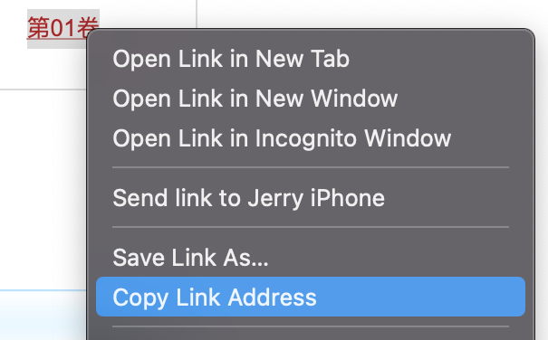

### Description
This program will convert the comic.acgn.cc view page to the .pdf like a book.
The following output will show when the program finish
```
=========================
{book_name}  {pages_of_book} pages
{book_name}  {pages_of_book} pages
{book_name}  {pages_of_book} pages
=========================
```

### Installation
```
git clone https://github.com/jerrykhh/acgn.convert.git
cd acgn.convert
pip install -r requirements.txt
```

### Usage 
```
python main.py
```
Enter following information:
```
ACGH.convert starting...
Please enter EXIT to start the PDF generate
Please Enter the URL: [Please Enter the View page such as "https://comic.acgn.cc/view-66017.htm"]
[1]: https://comic.acgn.cc/view-66017.htm
Please Enter the URL: [If Enter "EXIT" it will start to generate the Book pdf]
```


### Limitation
> Only support: [https://comic.acgn.cc/](https://comic.acgn.cc/)
